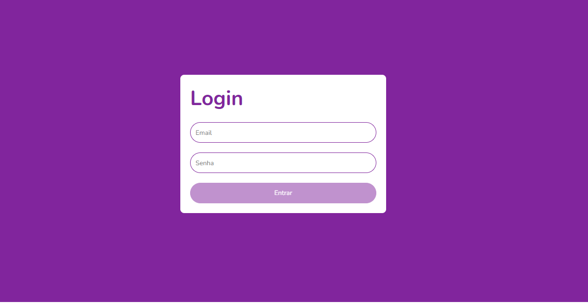

<h1 align="center">
  
</h1>

# Projeto Login

Esta aplicação foi utilizada no Bootcamp Orange Tech+ para aplicar os conceitos sobre validação, uso do Yup, react-hook-form e TypeScript.

## Tarefa

- Mudar o botão para habilitado ou desabilitado de acordo com a validação do formulário de login.

- ## Alterações

- Adição da propriedade `opacity` do botão caso o botão esteja desabilitado
- Alteração do estilo ao passar com o mouse por cima do botão, as propriedades `box-shadow` e `border` estão substituindo a propriedade `opacity`.
